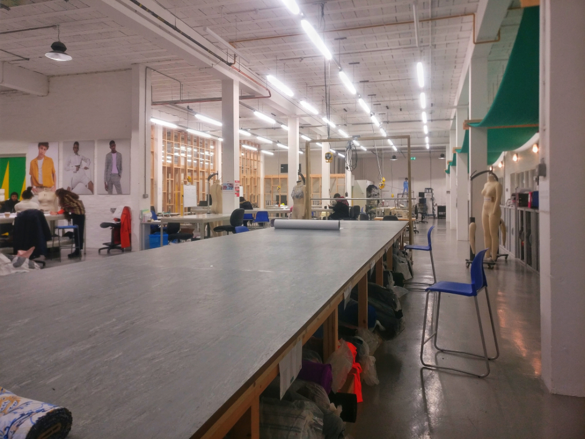

One of our driving principles is to understand how clothing is made. Armed with this understanding we want to rethink current production processes. The ultimate goal is to produce our own clothing collection and to have a complete grasp of how our pieces of clothing come into being: from seed to skirt, from sheep to shirt.  In order to acquire the necessary knowledge and skills I (Nick) have started on a series of clothes making courses at the [Fashion Technology Academy](https://fcfta.com/) (FTA) in North London.

## Why the FTA?

The FTA is unique in that the learning environment is based around a working clothing factory in North London. This means that the idea of _making_ clothing, as opposed to only _designing_ clothing, permeates the curriculum. This aligns exactly with the desire at First Principals to be a _maker_ company, rather than a Fashion Company (see our blog post _[Why First Principals is not a Fashion Company](https://www.fromfirstprincipals.com/blog/why-first-principals-is-not-a-fashion-company)_ for more on this). 

Learning how to make clothing involves understanding not only the design process but also the manufacturing process, which is something very different from just repeating whatever the designer did to create the first sample of the garment. When manufacturing we have to produce hundreds or thousands of instances of a garment. This must be done while minimizing wasted time and materials.

Once the material for the garment has been selected, the manufacturing proceeds through two stages: pattern making/cutting and stitching. These are the skills that we will develop at the FTA. Patterns are the building blocks from which the clothing is made. The patterns are laid out as efficiently as possible on the fabric. The fabric is then cut according to the patterns. The pieces of fabric are then stitched together into finished garments. When stitching a garment there are many decisions to make about which techniques to use, for instance what kind of needle, what kind of stitch... Making the correct choices is essential to ensure not only that the finished garments will look good, but also that they are solid and will last.

## Small batch production

The goal of attending the FTA is to acquire the necessary skills to design and manufacture a small collection of sustainable and ethical clothing. Our focus will not be on the creation of unique artistic pieces. Instead we will draw on well established designs and apply these to carefully sourced natural materials. We will do the hard work of making the clothing ourselves. Importantly, we hope to produce non-trivial volumes of clothing (in the order of 100’s of pieces). This is because we believe that if sustainable and ethical production is ever going to replace the current system, it must accommodate the demand (and consumers must kick their addiction to cheap throw-away apparel). This will never be the case if the only alternative to the current system of mass production is the production of individually crafted garments. By running small batch production we hope to offer our clients a beautiful high quality product, with the highest environmental and ethical standards at an affordable price.
 